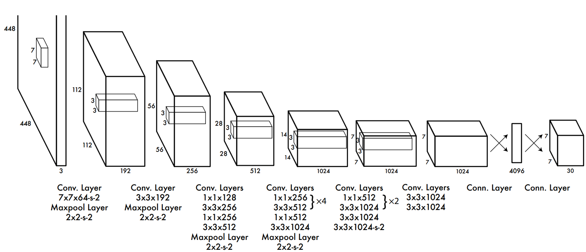
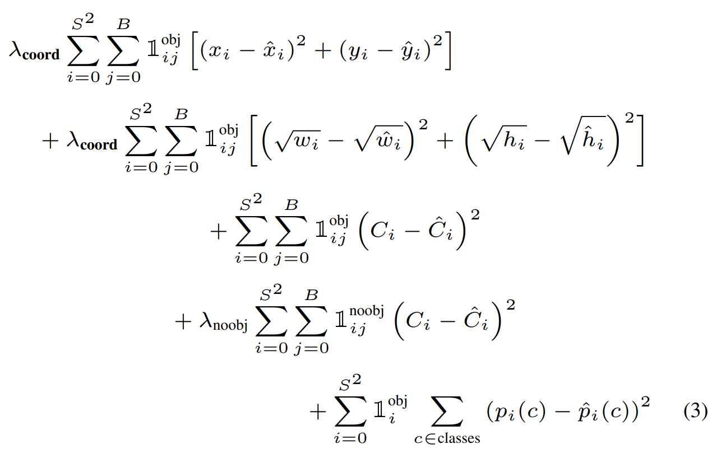

# YOLO (You Only Look Once) Model

YOLO is a state-of-the-art, real-time object detection system. Its name emphasizes that the algorithm makes predictions for objects after looking at the image only once.

The model is known for its speed and accuracy, making it a popular choice for real-time applications.

## Model Architecture

Here is a visualization of the YOLO model architecture.

## Model Loss

The following graph shows the training loss over epochs, which helps in evaluating the model's performance.

